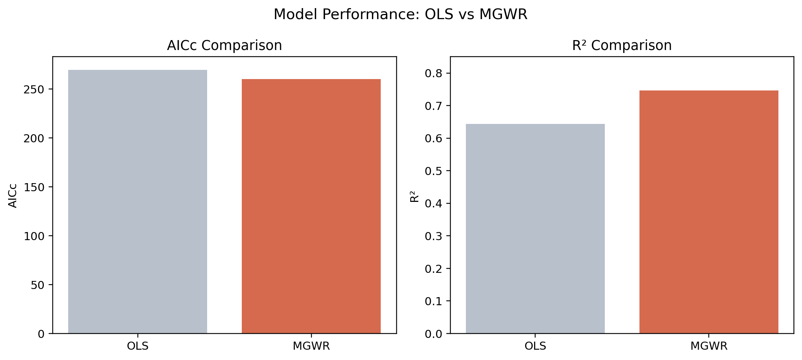
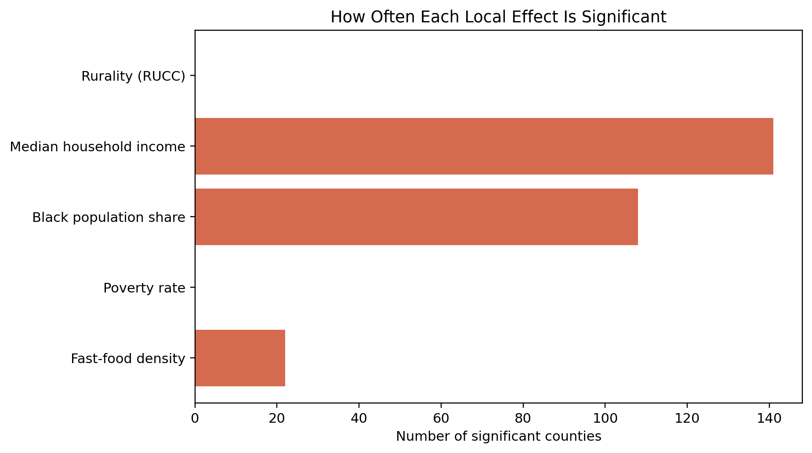
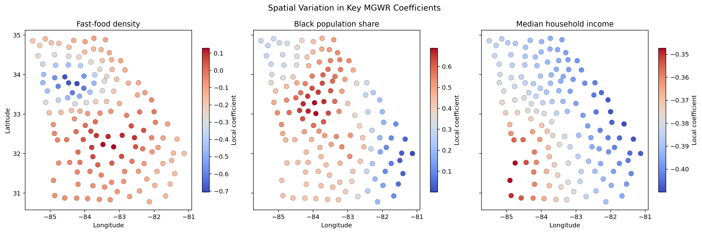
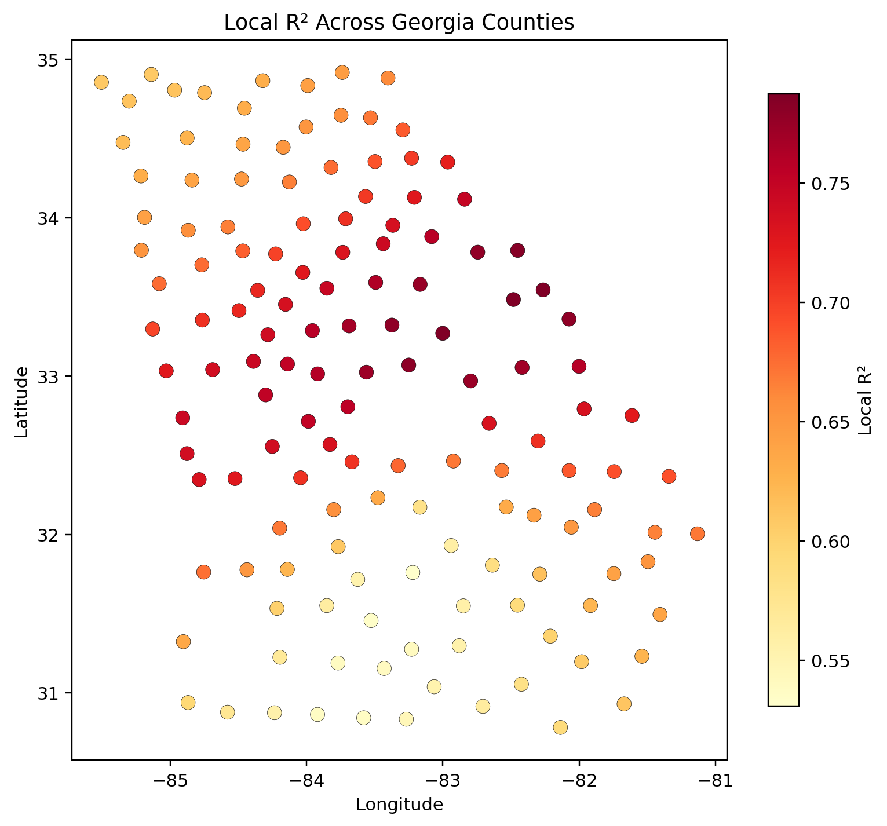

# Georgia州县级肥胖率MGWR分析报告

## 1. 研究目的

本研究以美国 Georgia 州 141 个县为研究单元，使用多尺度地理加权回归（MGWR）分析县级肥胖率与快餐店密度、贫困率、黑人比例、家庭收入中位数以及城市化/农村性水平之间的空间异质性关系，重点回答以下问题：

1. 肥胖率与这些社会经济变量是否存在显著相关关系。
2. 这种相关关系是否在州内不同地区表现出空间差异。
3. 哪些变量更接近“全局作用”，哪些变量更接近“局地作用”。

## 2. 数据与模型设定

- 因变量：`obesity_adjprev_2025`，县级肥胖率年龄调整值。
- 自变量：`fastfood_per_1000_pop_2020`、`poverty_rate_2021`、`pct_non_hispanic_black_2020`、`median_household_income_2021`、`rucc_2023`。
- 空间坐标：`x`、`y`，为投影坐标。
- 样本量：141 个县。
- 模型类型：Gaussian MGWR。
- 核函数：Adaptive bisquare。
- 带宽选择准则：AICc。
- 变量标准化：已开启，因此系数可在同一模型内比较相对影响强弱。

## 3. 模型整体表现

相较于全局 OLS，MGWR 明显提高了模型拟合效果：

- OLS 的 `R² = 0.644`，MGWR 的 `R² = 0.746`，提高了约 0.102。
- OLS 的 `AICc = 269.453`，MGWR 的 `AICc = 260.237`，下降了约 9.216。
- MGWR 的调整后 `R² = 0.700`，说明在考虑模型复杂度后，空间异质性建模依然带来明显改进。

这表明 Georgia 州肥胖率的影响机制并非完全稳定的全局过程，而是存在较强的空间异质性，使用 MGWR 是合理且必要的。

图1 模型整体表现对比。左图显示 MGWR 的 AICc 明显低于 OLS，右图显示 MGWR 的 R² 更高，说明引入空间异质性后，模型对肥胖率差异的解释能力有实质提升。

## 4. 全局回归结果解读

在进入解释之前，先列出全局回归（OLS）结果：

| 变量 | 系数 Est. | 标准误 SE | t值 | p值 |
| --- | ---: | ---: | ---: | ---: |
| Intercept | 0.000 | 0.051 | 0.000 | 1.000 |
| fastfood_per_1000_pop_2020 | -0.110 | 0.054 | -2.042 | 0.041 |
| poverty_rate_2021 | 0.224 | 0.134 | 1.677 | 0.094 |
| pct_non_hispanic_black_2020 | 0.327 | 0.072 | 4.557 | 0.000 |
| median_household_income_2021 | -0.367 | 0.116 | -3.157 | 0.002 |
| rucc_2023 | 0.044 | 0.069 | 0.645 | 0.519 |

从表中可以看出：

- `pct_non_hispanic_black_2020` 对肥胖率呈显著正相关，说明黑人比例较高的县往往具有更高的肥胖率。
- `median_household_income_2021` 对肥胖率呈显著负相关，说明收入越高，肥胖率通常越低。
- `fastfood_per_1000_pop_2020` 呈显著负相关，但这一结果与直觉并不完全一致，需要结合空间异质性进一步判断。
- `poverty_rate_2021` 为正，但仅达到边际显著。
- `rucc_2023` 不显著。

换言之，OLS 给出了“全州平均意义上的关系方向”：收入越高，肥胖率越低；黑人比例越高，肥胖率越高；快餐店密度在平均意义上反而与肥胖率呈负相关；而贫困率和城乡性变量在全局模型中解释力较弱。

不过，OLS 只能告诉我们平均意义上的方向，不能说明这些关系在州内是否一致，因此还需要进一步看 MGWR 的局地结果。

## 5. MGWR结果解读

在展开具体解读之前，先列出 MGWR 的关键结果。首先是模型诊断与变量带宽：

| 指标 | 结果 |
| --- | ---: |
| Residual sum of squares | 35.881 |
| Effective number of parameters | 21.170 |
| Sigma estimate | 0.547 |
| Log-likelihood | -103.588 |
| AIC | 251.517 |
| AICc | 260.237 |
| BIC | 316.893 |
| R² | 0.746 |
| Adj. R² | 0.700 |

| 变量 | 带宽 Bandwidth | ENP_j | Adj t-val(95%) | DoD_j |
| --- | ---: | ---: | ---: | ---: |
| Intercept | 127 | 1.845 | 2.234 | 0.876 |
| fastfood_per_1000_pop_2020 | 43 | 8.231 | 2.786 | 0.574 |
| poverty_rate_2021 | 138 | 1.413 | 2.125 | 0.930 |
| pct_non_hispanic_black_2020 | 48 | 6.646 | 2.712 | 0.617 |
| median_household_income_2021 | 140 | 1.369 | 2.111 | 0.937 |
| rucc_2023 | 138 | 1.666 | 2.192 | 0.897 |

上表说明，MGWR 不仅整体拟合优于 OLS，而且不同变量对应着不同的最优空间尺度，这正是 MGWR 相比传统 GWR 和 OLS 的核心优势。

其次，为了便于后文解读，再汇总各变量局地系数的统计特征与显著县数量：

| 变量 | 系数均值 | 最小值 | 最大值 | 显著县数量 | 显著占比 |
| --- | ---: | ---: | ---: | ---: | ---: |
| fastfood_per_1000_pop_2020 | -0.156 | -0.705 | 0.129 | 22 | 15.6% |
| poverty_rate_2021 | 0.078 | 0.042 | 0.136 | 0 | 0.0% |
| pct_non_hispanic_black_2020 | 0.413 | 0.001 | 0.688 | 108 | 76.6% |
| median_household_income_2021 | -0.385 | -0.410 | -0.347 | 141 | 100.0% |
| rucc_2023 | 0.078 | 0.045 | 0.131 | 0 | 0.0% |

从这张汇总表可以先得到一个整体印象：收入变量最稳定，黑人比例最强且空间差异明显，快餐店密度只在少数县显著，而贫困率和 RUCC 在本次模型中没有形成显著的局地独立效应。

### 5.1 变量作用尺度

MGWR 带宽结果显示不同变量具有不同空间尺度：

- `median_household_income_2021` 带宽为 140，接近全样本，说明其作用接近全局稳定过程。
- `poverty_rate_2021` 带宽为 138，`rucc_2023` 为 138，也偏向大尺度、较稳定过程。
- `fastfood_per_1000_pop_2020` 带宽为 43，`pct_non_hispanic_black_2020` 为 48，明显更局地化，说明这两个变量在不同地区的作用差异更强。

这说明收入、贫困和城乡性对肥胖率的作用相对平滑，而快餐密度和黑人比例的影响更依赖具体地区背景。

图2 各变量局地显著县数量对比。可以看到，收入变量在全部县均显著，黑人比例在多数县显著，而快餐密度只在少数县显著，贫困率和 RUCC 在本模型下没有形成显著的局地独立作用。

### 5.2 各变量局地影响方向与显著性

#### 1. 快餐店密度

- 系数均值为 `-0.156`，范围为 `-0.705` 到 `0.129`。
- 在 141 个县中，仅有 22 个县达到局地显著，而且全部为显著负向。
- 这些显著负向县主要集中在亚特兰大都市圈及其外围，包括 `Fulton`、`DeKalb`、`Cobb`、`Gwinnett`、`Clayton`、`Cherokee`、`Henry`、`Rockdale` 等。

这一结果说明：在 Georgia 州内，快餐店密度并没有普遍推高肥胖率；相反，在都市化程度较高的县，快餐密度较高反而对应更低的肥胖率。一个较合理的解释是，快餐店密度在都市地区不仅代表“不健康食物可达性”，也可能代表商业活跃度、就业密度、交通可达性、人口流动性以及更多替代性餐饮选择。因此，这一变量更像是“都市商业环境”代理变量，而不是单纯的饮食风险变量。该结果不能直接解释为“快餐越多越健康”，更不能据此做因果推断。

#### 2. 贫困率

- 系数均值为 `0.078`，范围为 `0.042` 到 `0.136`。
- 所有县系数方向均为正，但没有任何县达到局地显著。

这说明贫困率与肥胖率之间存在一致的正相关方向，但在纳入收入、黑人比例、城乡性和快餐密度后，其独立解释力不足，可能与其他结构性变量存在较强共变关系。换言之，贫困更像是背景性风险因素，而不是本模型中最核心的局地驱动因素。

#### 3. 黑人比例

- 系数均值为 `0.413`，范围为 `0.001` 到 `0.688`。
- 有 108 个县达到局地显著，且全部为显著正向，占全部样本的约 `76.6%`。
- 作用最强的县主要出现在 Georgia 中东部和中部地区，如 `Butts`、`Monroe`、`Lamar`、`Spalding`、`Jasper`。
- 非显著县主要分布在沿海和东南部部分县，如 `Chatham`、`Bryan`、`Liberty`、`McIntosh` 等。

这说明黑人比例是本研究中最重要的正向影响因素之一，而且其作用具有明显空间异质性。在州中部、东中部地区，该变量与肥胖率的关联最强；而在沿海地区，这种关系明显减弱。这种空间差异提示：族裔结构对健康结果的影响并非孤立作用，而是与地区社会经济条件、医疗可达性、社区环境和历史发展路径共同作用。

#### 4. 家庭收入中位数

- 系数均值为 `-0.385`，范围为 `-0.410` 到 `-0.347`。
- 141 个县全部达到局地显著，且全部为显著负向。
- 这说明收入增加对降低肥胖率具有非常稳定且普遍的作用，是本研究中最稳定的保护性因素。

从带宽和系数范围看，收入变量几乎表现为全州一致的负向作用，只存在幅度上的轻微差异。这意味着无论是在都市县还是农村县，较高收入通常都与更低肥胖率相联系。该结论具有较强稳健性，也是最适合在报告中作为“主结论”强调的变量。

#### 5. 城乡性（RUCC）

- 系数均值为 `0.078`，范围为 `0.045` 到 `0.131`。
- 所有县系数均为正，但没有县达到局地显著。

这说明越偏农村的县，其肥胖率倾向于更高，但这种关系在控制了收入、族裔结构、贫困和快餐密度后，不足以成为显著的独立局地机制。换言之，城乡性对肥胖率的影响可能更多是通过收入结构、人口结构和生活方式变量间接体现。

图3 关键局地回归系数的空间分布。左图显示快餐密度的负向作用主要集中在亚特兰大都市圈附近，表明这一变量具有显著局地性；中图显示黑人比例在中部和东中部地区的正向作用更强；右图显示收入变量在全州范围内均表现为稳定的负向作用，只是强度略有变化。

## 6. 空间拟合差异

局地 `R²` 在各县之间差异明显：

- 平均值为 `0.670`。
- 最大值为 `0.787`，最小值为 `0.531`。
- 拟合较好的县主要集中在州中东部，如 `McDuffie`、`Columbia`、`Hancock`、`Lincoln`、`Baldwin`、`Putnam`、`Richmond`、`Wilkes`、`Greene`、`Washington`。
- 拟合较弱的县主要集中在南部，如 `Ben Hill`、`Tift`、`Thomas`、`Brooks`、`Colquitt`、`Cook`、`Berrien`、`Lowndes`、`Turner`、`Lanier`。

这说明当前模型在 Georgia 州中东部地区解释力较强，而在南部部分县仍有遗漏机制，未来可以考虑加入体育活动设施、教育水平、医疗可及性、食品荒漠程度、汽车依赖度等变量进一步改进。

图4 局地 R² 的空间分布。暖色区域代表模型解释力更高，主要集中在州中东部；南部部分县解释力偏弱，说明这些地区可能还受到未纳入变量的影响。

## 7. 结论

本次 MGWR 分析可以得出以下几点主要结论：

1. Georgia 州县级肥胖率存在明显空间异质性，MGWR 明显优于全局 OLS。
2. 家庭收入中位数是最稳定、最普遍的负向因素，且在所有县均显著。
3. 黑人比例是最重要的正向因素之一，且在大多数县显著，但作用强度在空间上差异明显。
4. 快餐店密度只在少数都市县显著，且表现为负向关系，说明它更可能反映都市商业环境，而非单一饮食风险。
5. 贫困率和城乡性虽然方向上为正，但在本模型中未表现出显著的独立局地效应。

总体上看，Georgia 州肥胖率更强地受到收入和族裔结构相关因素影响，而快餐店密度的作用具有较强情境性，不能简单用单一线性逻辑解释。

## 8. 研究局限

- 本研究使用的是横截面生态数据，只能说明相关性，不能说明因果关系。
- 不同数据源年份并不完全一致，存在一定时序错位。
- 快餐店指标在部分县缺失，最终模型仅使用 141 个县。
- RUCC 是城乡性代理变量，并非直接的“城市化率”。
- 肥胖率和体力活动不足率同源于 CDC PLACES，若后续加入同源变量，需要注意潜在的统计依赖。

## 9. 输出文件

- 结果摘要：`MGWR_session_summary.txt`
- 局地结果：`MGWR_session_results.csv`
- 局地显著性统计：`MGWR_local_significance_summary.csv`
- 图件目录：`figures/`
- 出图脚本：`scripts/analyze_mgwr_georgia_obesity.py`
